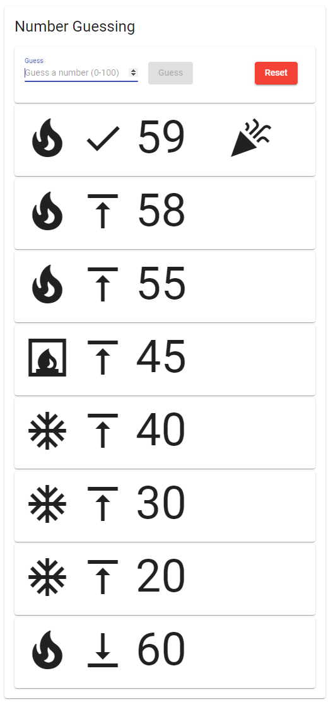
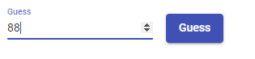

:icons: font

= Number Guessing

In this -- pretty relaxed -- exercise you are going to continue training your skills when working with multiple components and interaction between them.

The task is to develop a simple number guessing game:

* The computer randomly chooses a number between 0 and 100
* Then the user attempts to guess that number
* The user receives hints:
** If the number is bigger or smaller than the guess
** And some indication how close he/she already is

Here is a sample run of the finished application:

Your design can, of course, be better than that 😉

This time no server/back-end is required, but the client application will consist of (at least) *three* Angular components.

== Main Component

The main (app) component not only controls the game's logic, but also keeps track of the attempts which have been already made.
The `class` could look like that, but you may find a different solution if you want to:

[plantuml]
----
@startuml
class AppComponent {
    + attempts: Attempt[]
    - randNo: number;
    - input: GuessInputComponent

    + reset(): void
    + handleGuess(numberGuessed: number): void
    - getNewRandNo(): void
}
@enduml
----

It also defines the following types to be used throughout the application:

[plantuml]
----
@startuml
hide methods
enum HighLow {
    High,
    Low,
    Hit
}
enum Range {
    Cold,
    Warm,
    Hot
}
class Attempt {
    + guess: number
    + highLow: HighLow
    + range: Range
}
@enduml
----

The following features are required:

* Calculate a random number between 0 and 100
* Process the user's guesses to decide:
** Did the user guess the correct number?
*** If yes disable the 'guess' button *by accessing the child component*
**** _Hint: if you don't know how, have a look at `ViewChild`_
** If not:
*** How far off is he/she?
*** Is the guess too low or too high?
* Display the guesses of the user
** Utilize the `GuessAttemptComponent` for that
** *Display the latest guess on top*
* Reset the game to start again (with a new number)

== Guess Input & Control Component

This component handles the input of the user while ensuring it stays in the correct range.
Additionally, I placed the reset button here as well -- you may use another component for that if you want to or even put it in the main component.
Thus, the component could look like that:

[plantuml]
----
@startuml
class GuessInputComponent {
    + numberGuessed: number | null
    + guessEvent: EventEmitter<number>
    + resetEvent: EventEmitter<void>
    + success: boolean

    + submitGuess(): void
    + ensureRange(): void
    + setCorrectGuess(): void
    + reset(): void
}
@enduml
----

The following features are required:

* Make sure the user input stays in the correct range (0-100)
** If a value > 100 is entered set it to 100
** If a value < 0 is entered set it to 0
* Allow the user to submit a guess either by clicking on the button or by pressing `Enter` on the keyboard
** The processing of the guess (right or wrong,...) happens in the parent component
* After the guess has been submitted clear the input field
* The submit button (and `Enter` submit functionality) is _disabled_ when:
** Either the input field is empty or the input invalid
** Or if the `success` property has been set to `true` (via the `setCorrectGuess` method)
*** *This will be done by the `app` component by accessing its child component!*
** Enabled Button: +

* If you placed the `reset` button here you need to notify the parent component about the user's whish to reset the game and also do some housekeeping for the properties of this component

== Attempt Display Component

The main (app) component creates an instance of the `Attempt` class for every guess attempt the user makes.
The job of this component is to display a single one of those attempts in an easily understandable way.

To this end use the `Material Icons` which are based on a Google Font which is already available in a new, default Angular application (`<link href="https://fonts.googleapis.com/icon?family=Material+Icons" rel="stylesheet">`).
However, you'll also need to add `MatIconModule` to your `imports`.
You do _not_ have to use the same icons as in the example if you think others are a better fit for the information we want to transport.

The main task of this component is to map the `enum` values of the `Attempt` instance to icons.
*Try to use https://www.typescriptlang.org/docs/handbook/classes.html#accessors[getter] properties for this job!*

It could then look like this:

[plantuml]
----
@startuml
hide methods
class GuessAttemptComponent {
    + attempt: Attempt
    + <get> num: number
    + <get> range: string
    + <get> direction: string
    + <get> hit: boolean
}
@enduml
----

== Goal

After this exercise you should have a clear understanding of interaction (transferring data, sending events) between parent and child components.
This includes how and when to use `Input`, `Output`, `ViewChild` & `EventEmitter`.

Later on we'll learn how to use a `DataService` to exchange (huge amounts of) information between not directly 'related' components.

*Of course, for this assignment the same rules (git commits, linter,...) apply as for the previous ones!*
